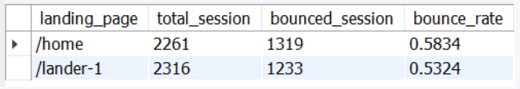

## SITUATION

You’ve just been hired as an eCommerce Database Analyst for Maven Fuzzy Factory, an online retailer which has just launched their first product.

## BRIEF

As a member of the startup team, you will work with the CEO, the Head of Marketing, and the Website Manager to help steer the business.

You will analyze and optimize marketing channels, measure and test website conversion performance, and use data to understand the impact of new product launches.

## PROJECT SOURCE

- Advanced SQL: MYSQL Data Analysis and Business Inteliigence UDEMY

## TOOLS USED
 - MYSQL
 
 ## DATABASE
 
 We will be working with six related tables, which contain eCommerce data about:
 
 - Website Activity
 - Products
 - Orders & Refunds
 
 ## Entity Relationship Diagram
 
 
 
 ## ANALYZING TRAFFIC SOURCES
 
 ### Business Concept: Traffic Source Analysis
 
 Traffic source analysis is about understanding **where your customers are coming from** and **which channels are driving the highest quality traffic.**
 
 ### Common Use Cases : Traffic Source Analysis
 
 - Analyzing search data and shifting budget towards the engines, campaigns or keywords driving the strongest conversion rates
 - Comparing user behavior patterns across traffic sources to inform creative and messaging strategy
 - Identifying opportunities to eliminate wasted spend or scale high-converting traffic

## TASK

### 1. FINDING TOP TRAFFIC SOURCES

#### Steps:

- Breakdown of sessions by UTM source, campaign and referring domain
- Filter results up to sessions before '2012-04-12' and group results by utm_source, utm_campaign and http_referer

#### Query:

#### Result:

-  Most sessions came from gsearch nonbrand campaign traffic.

### 2. TRAFFIC CONVERSION RATE

#### Steps:

- Calculate CVR from session(COUNT) to order(COUNT). If CVR < 4% need to reduce bids, otherwise if CVR >= 4% can increase bids to drive more volume
- Filter sessions < '2012-04-12', utm_source = 'gsearch' and utm_campaign = 'nonbrand'

#### Query:

#### Result:

- The conversion rate is less than 4%, which is 2.88%, hence we have to reduce bids. 

### Business Concept: Bid Optimization

Analyzing for bid optimization is about **understanding the value of various segments of paid traffic, so that you can optimize your marketing budget.**

### Common Use Cases: Bid Optimization

- Using conversion rate and revenue per click analyses to figure out how much you should spend per click to acquire customers
- Understanding how your website and products perform for various subsegments of traffic (i.e. mobile vs desktop) to optimize within channels
- Analyzing the impact that bid changes have on your ranking in the auctions, and the volume of customers driven to your site

### 3. TRAFFIC SOURCE TRENDING

#### Steps:

- Calculate trend and impact on sessions for gsearch nonbrand campaign after bidding down on Apr 15, 2021
- Filter to < '2012-05-10', utm_source = 'gsearch', utm_campaign = 'nonbrand'

#### Query:

#### Result:

- The sessions after 2021-04-15 have dropped. Continue to monitor session volume. 

### 4. TRAFFIC SOURCE BID OPTIMIZATION

#### Steps:

- Calculate the conversion rate from session to order by device type

#### Query:

#### Result:

- Desktop bids were driving nearly 4% of the conversion rate, so we should transfer the paid traffic spent to the desktop channel instead.

### 5. TRAFFIC SOURCE SEGMENT TRENDING

#### Steps:

- Calculate (with pivot) weekly session trends for both desktop and mobile after bidding up on the desktop channel on 2012-05-19
- Filter to between '2012-04-15' to '2012-06-19', utm_source = 'gsearch', utm_campaign = 'nonbrand'

#### Query:

#### Result:

- Desktop volume increased after bidding on 2012-05-19, but mobile volume dropped dramatically. Focusing on desktops was able to optimize spending efficiently.

## ANALYZING WEBSITE PERFORMANCE

### Business Concept : Analyzing Top Website Content

Website content analysis is about **understanding which pages are seen the most by your users, to identify where to focus on improving your business.**

### Common Use Cases: Analyzing Top Website Content

- Finding the most-viewed pages that customers view on your site
- Identifying the most common entry pages to your website – the first thing a user sees
- For most-viewed pages and most common entry pages, understanding how those pages perform for your business objectives

### TASK

### 1. IDENTIFYING TOP WEBSITE PAGES

#### Steps:

- Find page view count by page view url, filter date < 2012-06-09 and sort session count descencing

#### Query:

#### Result:

- homepage, products, and original Mr Fuzzy are the most-viewed website pages with the highest traffic.

### 2. IDENTIFYING TOP ENTRY PAGES

#### Steps:

- Create cte to find the first page landed/entry for each session, filter date to < 2012-06-12
- Count session based on landing page

#### Query:

#### Result:

-  Homepage is the top landing page. Analyze landing page performance, for the homepage specifically.

### Business Concept : Landing Page Performance and Testing

Landing page analysis and testing is about **understanding the performance of your key landing pages and then testing to improve your results.**

### Common Use Cases: Landing Page Performance and Testing

- Identifying your top opportunities for landing pages – high volume pages with higher than expected bounce rates or low conversion rates
- Setting up A/B experiments on your live traffic to see if you can improve your bounce rates and conversion rates
- Analyzing test results and making recommendations on which version of landing pages you should use going forward

### 3. BOUNCE RATE ANALYSIS

#### Steps:

- Find the first website_pageview_id for relavant seasson with filter to date < '2012-06-14' and pageview_url is '/home'
- Count page views for each session to identify bounces (website_pageview_id = 1)
- Summarize by counting total session and bounced session

#### Query:

 - A 60% bounce rate is pretty high especially for paid search.

### 4. ANALYZING LANDING PAGE TESTS

#### Steps:

- Find when /lander-1 was created on the website by use either date or pageview id to limit the results
- Find the first website_pageview_id for relavant season with filter by date periode, between '2012-06-01' and '2012-08-31'
- Count page views for each session to identify bounces (website_pageview_id = 1) each landing page
- Summarize by counting total session and bounced session each landing page

#### Query:

- The Lander page has a lower bounce rate than home page. Fewer customers have bounced on the lander page.

### 5. LANDING PAGE TREND ANALYSIS

#### Steps:

- Pull paid gsearch nonbrand campaign traffic on /home and /lander-1 pages, trended weekly since 2012-06-01 and the bounce rates.
- Find the first website_pageview_id for relavant season with select created_at and filter
- Count page views for each session to identify bounces (website_pageview_id = 1)
- Summarize sessions, bounced sessions and bounce rate by week

#### Query:

- All traffict was directed to home until 2012-06-17, and starting on 2012-08-05, all traffic was directed to lander-1. There has been improvement as the bounce rate decreased from more than 60% to about 50%.

### Business Concept : Analyzing and Testing Conversion Funnels

Conversion funnel analysis is about **understanding and optimizing each step of your user’s experience on their journey toward purchasing your products.**

### Common Use Cases: Analyzing and Testing Conversion Funnels

- Identifying the most common paths customers take before purchasing your products
- Identifying how many of your users continue on to each next step in your conversion flow, and how many users abandon at each step
- Optimizing critical pain points where users are abandoning, so that you can convert more users and sell more products

### 6. BUILDING CONVERSION FUNNELS

#### Steps :

- Select all pageviews for relevant session, create pageview level in temporary table, filter to date between '2012-08-05' and '2012-09-05'
- Aggregate data to assess funnel performance
- Agregate data to be click rate

#### Query:

 
 
